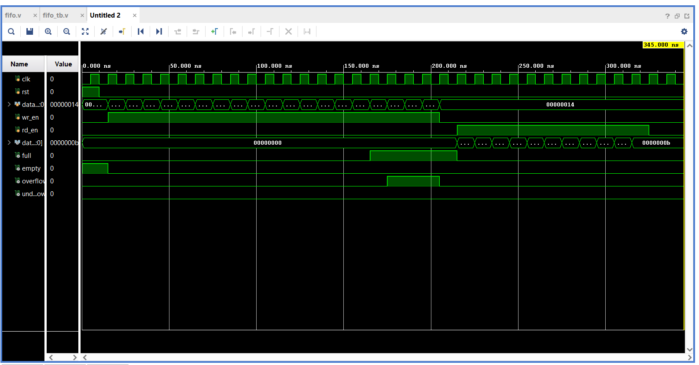

# Synchronous FIFO using Verilog HDL

## Project Overview
This project implements a 32-bit Synchronous FIFO (First In First Out) memory using Verilog HDL. The FIFO is designed to store and retrieve data in the same order in which it is written. Both read and write operations are controlled using a single clock signal, which makes it a synchronous FIFO.

The design includes status flags such as Full, Empty, Overflow, and Underflow to ensure proper FIFO operation and error handling during invalid read/write conditions.

## Features
- 32-bit data width
- FIFO depth of 16 locations
- Single clock operation
- Full and Empty flag generation
- Overflow detection
- Underflow detection
- Separate read and write pointers
- Count-based FIFO tracking
- Simulation verified using testbench

---

## FIFO Working
- Data is written into the FIFO when 'wr_en' is high and FIFO is not full.
- Data is read from the FIFO when 'rd_en' is high and FIFO is not empty.
- The write pointer increments after every successful write operation.
- The read pointer increments after every successful read operation.
- The 'full' flag becomes high when FIFO storage reaches maximum capacity.
- The 'empty' flag becomes high when all stored data has been read.
- Overflow condition occurs when write is attempted while FIFO is full.
- Underflow condition occurs when read is attempted while FIFO is empty.

---

## Files Included
### fifo.v
Contains the RTL design of the synchronous FIFO.

### fifo_tb.v
Contains the testbench used for simulation and verification.

### waveform.png
Simulation waveform showing FIFO write/read operations and flag behavior.

---

## Simulation Details
The FIFO design was simulated and verified in Xilinx Vivado.  
Simulation confirms:
- Correct write operation
- Correct read operation
- Proper Full and Empty flag generation
- Proper Overflow and Underflow handling

---

## Tools Used
- Verilog HDL
- Xilinx Vivado

---

## Learning Outcome
Through this project, I learned:
- FIFO architecture and working
- Sequential logic design
- Read and write pointer implementation
- Status flag generation
- Verilog coding and simulation
- Testbench development and waveform analysis

## Waveform

